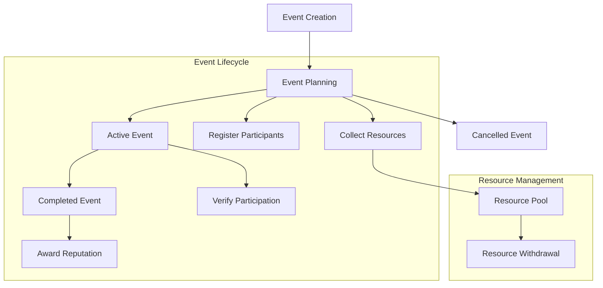

# EcoWeave Community Cleanup Network

A decentralized platform for organizing, funding, and participating in local environmental clean-up projects.

## Overview

EcoWeave provides the digital infrastructure needed to transform local environmental concerns into coordinated community action. The platform enables:

- Creation and management of local cleanup events
- Community funding and resource allocation
- Transparent participation tracking
- Reputation-based incentives for environmental stewardship
- Verification of cleanup activities

## Architecture

The EcoWeave smart contract system manages the full lifecycle of community cleanup events while tracking participation, handling resources, and distributing reputation tokens.



### Core Components

1. **User Profiles**: Tracks individual reputation scores, event participation, and contributions
2. **Cleanup Events**: Manages event details, status, and participant capacity
3. **Event Participation**: Records registrations, contributions, and verified participation
4. **Resource Management**: Handles STX-based funding and resource allocation

## Contract Documentation

### Key Data Structures

1. **Users Map**
   - Stores user profiles with reputation scores
   - Tracks events organized, participated in, and total contributions

2. **Cleanup Events Map**
   - Stores event details including location, date, status
   - Manages participant capacity and resource requirements

3. **Event Participants Map**
   - Links users to specific events
   - Records contribution amounts and participation status

### Access Control

- Event creation is open to all users
- Event management functions (activation, completion) restricted to event organizers
- Participation confirmation can only be done by event organizers
- Resource withdrawal limited to event organizers

## Getting Started

### Prerequisites

- Clarinet installed
- Stacks wallet for transactions
- STX tokens for contributions

### Basic Usage

1. **Create an Event**
```clarity
(contract-call? .ecoweave create-event 
    "Beach Cleanup" 
    "Community beach cleaning initiative" 
    "South Beach" 
    u1625097600 
    u50 
    u1000000)
```

2. **Register for an Event**
```clarity
(contract-call? .ecoweave register-for-event u1)
```

3. **Contribute Resources**
```clarity
(contract-call? .ecoweave contribute-to-event u1 u100000)
```

## Function Reference

### Event Management

`create-event`
- Creates a new cleanup event
- Parameters: name, description, location, date, max-participants, resources-needed
- Returns: event-id

`activate-event`
- Transitions event from planned to active state
- Parameters: event-id
- Restricted to event organizer

`complete-event`
- Marks event as completed and adds verification data
- Parameters: event-id, verification-data
- Restricted to event organizer

### Participation

`register-for-event`
- Registers user for an event
- Parameters: event-id

`confirm-participation`
- Verifies user participation and awards reputation
- Parameters: event-id, participant
- Restricted to event organizer

### Resource Management

`contribute-to-event`
- Contributes STX to event resources
- Parameters: event-id, amount

`withdraw-resources`
- Withdraws STX from event pool
- Parameters: event-id, amount
- Restricted to event organizer

## Development

### Local Testing

1. Clone the repository
2. Initialize Clarinet project:
```bash
clarinet new
```
3. Run tests:
```bash
clarinet test
```

### Deployment Considerations

- Ensure proper testing of access control mechanisms
- Verify resource handling and STX transfer functionality
- Test event lifecycle state transitions thoroughly

## Security Considerations

### Known Limitations

- Resource withdrawal requires trust in event organizer
- Participation verification relies on organizer honesty
- No dispute resolution mechanism implemented

### Best Practices

1. **For Organizers**
   - Always verify participant identity before confirmation
   - Document cleanup verification data thoroughly
   - Manage resources transparently

2. **For Participants**
   - Verify event details before registration
   - Contribute resources only to trusted organizers
   - Keep evidence of participation

3. **For Developers**
   - Implement additional checks for large resource transfers
   - Consider adding time-locks for resource withdrawal
   - Add event reporting mechanisms